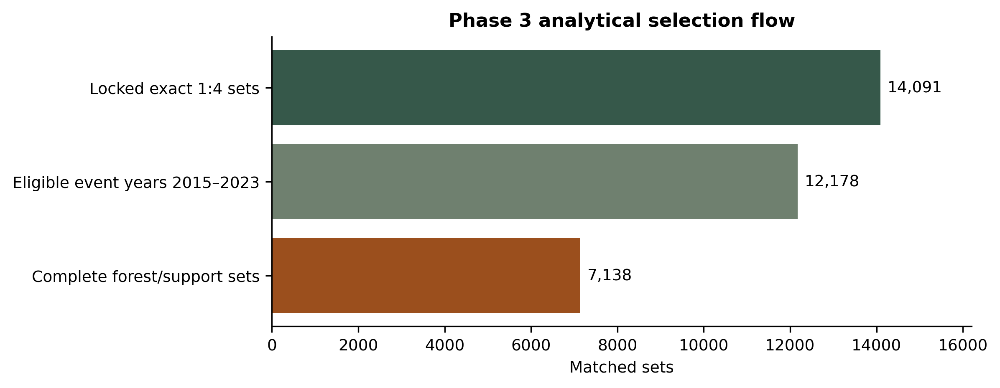
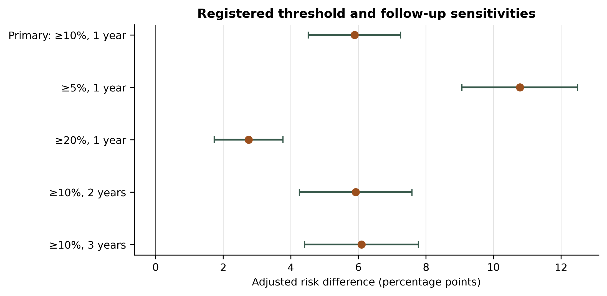
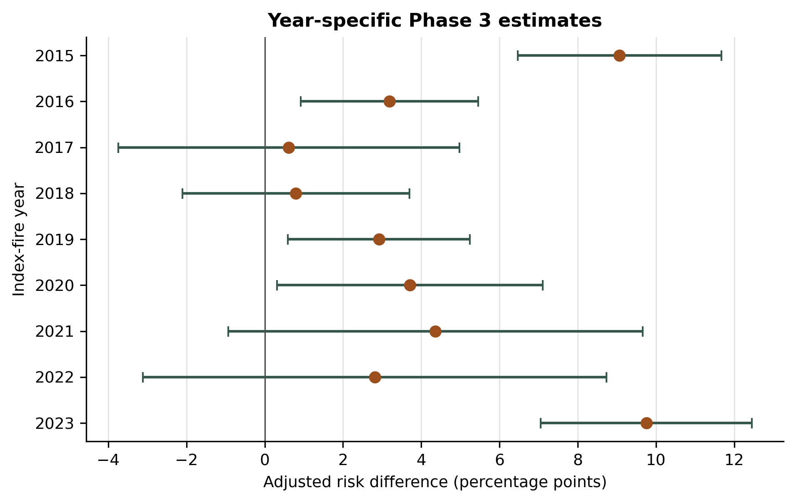
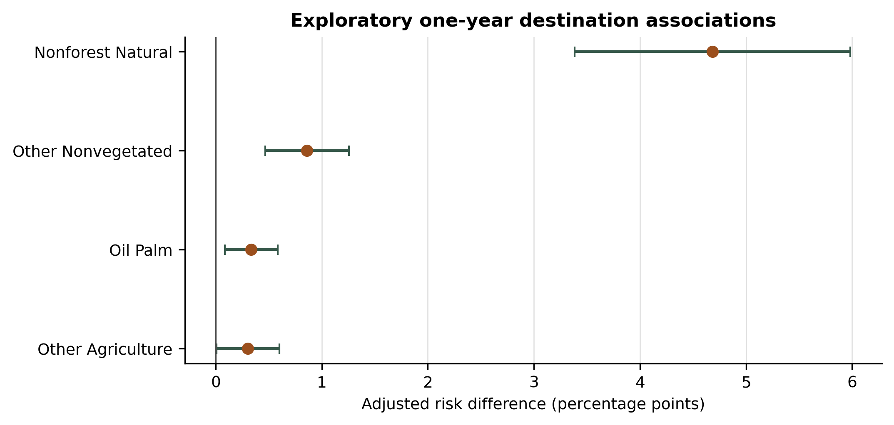

# Active-fire detections precede elevated mapped natural-forest loss in Kalimantan: a matched satellite-observation study, 2015–2023

**Manuscript status:** analysis-complete technical draft. Verified author names, affiliations, contributions, acknowledgements, target-journal style, and repository DOI must be supplied before submission.

## Abstract

Public discussion of Indonesian landscape fires frequently combines distinct claims about climate, peat condition, land conversion, intent, and governance. We tested a narrower question that the available open satellite data can identify: whether fire-positive baseline-forest cells in Kalimantan were more likely than same-day nearby fire-negative cells to undergo subsequent mapped natural-forest loss. We linked daily 1-km VIIRS fire opportunities to pre-event vegetation, CHIRPS rainfall, ERA5-Land weather and soil-water conditions, peat extent, and MapBiomas Indonesia Collection 4.1 annual land-cover transitions. Each positive cell was matched to four valid negative cells within 25 km on the same date. The frozen primary estimand was the adjusted within-set risk difference for loss of at least 10% of pre-index natural forest by the one-year follow-up map. Of 12,178 temporally eligible matched sets, 7,138 passed complete forest and observation-support rules; 41.4% were excluded, predominantly because pre-index forest cover was below 70%. Fire-positive cells had 13.74% unadjusted risk versus 4.40% among controls. The adjusted risk difference was +5.89 percentage points (95% CI +4.52 to +7.25; p=2.63×10^-17). Threshold, follow-up, influence, alternative-estimator, and coarser spatial-cluster checks retained a positive association. However, a pre-exposure negative-control interval was also positive (+2.31 points; 95% CI +1.13 to +3.50), indicating pre-existing land-change trajectory or residual confounding. A common-support post-minus-pre diagnostic remained positive (+3.08 points; 95% CI +1.53 to +4.63), but cannot be interpreted causally because parallel trends were not established. The data support a robust temporal association within the retained Kalimantan population. They do not establish deliberate ignition, an actor or beneficiary, government performance, or an Indonesia-wide or global pattern.

## 1. Introduction

Landscape fire in maritime Southeast Asia is shaped by interacting weather, hydrology, vegetation, and land management. The strong 2015 El Niño extended drought and amplified regional fire emissions, but climate is an enabling condition rather than an identification strategy for who ignited a fire or why [1]. Drainage and land cover can jointly modify fire occurrence in Indonesian peatlands, reinforcing the need to treat peat condition rather than peat presence alone as the relevant mechanism [2]. At the same time, annual land-cover maps can reveal what class follows forest loss, but a mapped sequence cannot by itself identify intent, ownership, legality, or profit.

This study therefore separates four questions that are often conflated: (i) whether dry conditions modify observed fire occurrence, (ii) whether fire-positive locations are followed by forest loss, (iii) which land-cover class is mapped after loss, and (iv) whether a named actor or policy caused the sequence. Phase 2 addressed the first question and found the pre-registered peat × dryness interaction inconclusive. The present Phase 3 addresses only the second and, exploratorily, the third.

We hypothesized that, among valid same-day matched opportunities in baseline natural forest, fire-positive 1-km cells would have a higher probability of losing at least 10% of their immediately pre-index natural-forest area within one annual-map follow-up than four nearby fire-negative controls. The analysis was frozen before annual outcomes were extracted. Its inferential geography is Kalimantan; national province and global country maps in the companion dashboard are descriptive context only.

## 2. Methods

### 2.1 Design and study population

The observational unit was a valid daily 1-km fire opportunity during July–November 2015–2025 within the fixed 2014 Kalimantan natural-forest cohort. VIIRS class 7–9 observations were fire-positive; class 5 clear-land observations were valid negatives; unobserved, cloud, water, and other fire-mask classes were excluded. A positive required a valid negative observation in the preceding 72 hours and no fire in the prior seven days. Each positive was exactly matched to four reusable same-date negative cells within 25 km. The land-cover outcome was only available through 2024; therefore the one-year primary analysis used event years 2015–2023. Events in 2024–2025 were not coded as having no change.

### 2.2 Data sources

Active-fire status came from NASA VIIRS VNP14A1/VNP14IMG science products, whose 375-m detection algorithm is described by Schroeder et al. [3]. Pre-event vegetation was summarized from MOD13Q1 EVI after quality screening. Rainfall came from CHIRPS, a 0.05° quasi-global station-enhanced precipitation record [4]. Hourly precipitation, vapour-pressure deficit, wind, and soil-water covariates were derived from ERA5-Land [5]. Peat extent was used as a landscape covariate. Annual forest support and transitions came from MapBiomas Indonesia Collection 4.1 (version 4.1.1), covering 1990–2024 at 30 m [6]. Provider-specific access, attribution, and redistribution terms are recorded in `DATA_LICENSE.md`.

### 2.3 Exposure, outcome, and eligibility

The exposure was index-day fire-positive status. The primary binary outcome equalled one when at least 10% of natural forest present in year *t*−1 transitioned to a non-natural-forest class by year *t*+1. Cells required at least 70% natural forest at the fixed 2014 baseline and immediately before the index year, and at least 95% observed pixels in both maps. If any member failed support, the entire matched set was removed. Missing or not-observed pixels were never set to zero.

Pre-registered sensitivities used 5% and 20% loss thresholds and two- and three-year follow-up. Exploratory destinations were non-forest natural vegetation, rice paddy, oil palm, pulpwood plantation, other agriculture, mining, urban, other non-vegetated land, aquaculture, and water. Destination analyses required at least 200 complete sets and 50 outcome-varying sets and used Holm correction within the destination family.

### 2.4 Statistical analysis

The primary model was a within-matched-set linear probability model. Matched-set effects were removed by demeaning. Covariates were baseline forest fraction, peat extent, log(1+7-day rainfall), log(1+30-day rainfall), pre-fire EVI, 72-hour vapour-pressure deficit, 24-hour maximum wind, and 72-hour root-zone soil water, standardized using 2015–2022 reference data. Standard errors used two-way clustering by 1-km cell and index date. The primary estimate was not multiplicity-adjusted because it was the single registered test.

Publication diagnostics included conditional logistic regression; continuous forest-loss share; exclusion of the top 0.5% and 1% of matched sets by score norm; year-specific and leave-one-year-out estimates; and block-plus-date clustering at 25, 50, and 100 km. A pre-exposure negative control used a one-year loss pair ending before the index event (maps *t*−3 to *t*−1). On observations with both intervals available, we also estimated within-set post-minus-pre differences. This diagnostic resembles a difference-in-differences contrast but is not causal because parallel trends were not established.

### 2.5 Reproducibility and privacy

The registered configuration, analysis code, tests, machine-readable outputs, figures, and tables are versioned. A build script creates a coordinate-free archive containing the locked opportunity frame and MapBiomas transition summary. Private cell coordinates, cloud credentials, raw provider archives, and national rasters are excluded. File hashes and dimensions are recorded in `publication/data/manifest.json`.

## 3. Results

### 3.1 Selection and primary result

The locked frame contained 14,091 exact 1:4 sets. Of 12,178 sets in primary-eligible event years, 5,040 were excluded and 7,138 were analysed (35,690 observations; 11,758 unique cells). Pre-index forest below 70% affected 5,031 excluded sets; pre-map and follow-up observation support each affected 11, and one set contained a negative CHIRPS sentinel. Reasons were non-exclusive. Selection was material: the largest included-versus-excluded standardized mean difference was 1.02 for immediately pre-index natural-forest fraction (Table S1).

The unadjusted outcome probability was 13.74% among positive cells and 4.40% among negative controls (risk ratio 3.12). The adjusted within-set risk difference was +5.89 percentage points (95% CI +4.52 to +7.25; p=2.63×10^-17; Figure 2). The adjusted continuous loss-share difference was +2.93 points.

### 3.2 Robustness and heterogeneity

Registered estimates remained positive at the 5% threshold (+10.78 points), 20% threshold (+2.76), two-year follow-up (+5.93), and three-year follow-up (+6.10); all 95% intervals excluded zero. Conditional logistic regression yielded an odds ratio of 3.46 (model-based 95% CI 3.09–3.89). Removing the most influential 0.5% and 1% of matched sets yielded +5.63 and +5.50 points. With spatial block and date clustering, 95% confidence intervals were +4.07 to +7.70 points at 25 km, +3.74 to +8.04 at 50 km, and +3.27 to +8.50 at 100 km.

Year-specific estimates ranged from +0.61 points in 2017 to +9.75 in 2023 and were individually imprecise in 2017, 2018, 2021, and 2022. Every leave-one-year-out estimate remained positive, ranging from +4.13 to +6.96 points (Figure 4). These patterns show temporal heterogeneity and do not justify describing one constant annual effect.

### 3.3 Negative control

The pre-exposure loss outcome was also associated with index-day fire status: +2.31 points (95% CI +1.13 to +3.50; p=0.000131; 3,915 sets). On the 3,453 sets with common pre- and post-support, the post-minus-pre binary contrast was +3.08 points (95% CI +1.53 to +4.63; p=9.95×10^-5). Thus later loss exceeded the prior difference on common support, but the positive negative control demonstrates that fire-positive cells were already on a different conversion trajectory or remained residually confounded.

### 3.4 Exploratory destinations

Four destination outcomes passed the frozen support gate after Holm correction: non-forest natural vegetation (+4.683 points), other non-vegetated land (+0.862), oil palm (+0.336), and other agriculture (+0.304). Rice paddy, pulpwood plantation, mining, urban, aquaculture, and water lacked sufficient matched-set outcome variation and were not estimated. These are mapped class transitions, not evidence that a fire was set to create a particular land use.

## 4. Discussion

Fire-positive cells in the retained Kalimantan baseline-forest population were more likely than same-day nearby controls to be followed by mapped natural-forest loss. The association was not explained by a single year, an influential-set tail, the registered threshold choice, or progressively coarser spatial clustering. The primary temporal ordering is therefore robust within the measured design.

The negative control changes the strength of interpretation. Because fire-positive cells also showed more forest loss in an interval ending before the index fire, matching and measured covariate adjustment did not create exchangeable exposure groups. The main estimate can indicate that fire is part of a broader conversion trajectory, that unmeasured land accessibility or management affects both fire and loss, or both. The common-support post-minus-pre result suggests that the post-index contrast exceeds the baseline difference, but without parallel trends, exogenous ignition, or a stronger quasi-experimental design it remains associational.

The small oil-palm destination estimate is compatible with some fire-positive cells later being mapped as oil palm. It is not evidence that those fires were intentionally set for oil palm, that a particular actor benefited, or that the mapped class is legally or institutionally attributable. Dated concession boundaries, plantation establishment, roads, enforcement actions, restoration interventions, ownership, and independent ground validation would be required for those questions.

The result cannot assess whether government mitigation or restoration was adequate because it contains no dated intervention or counterfactual policy design. It also cannot establish a national or global pattern: the inferential frame is Kalimantan, and the companion Indonesia and world maps combine separate descriptive sources. Cross-region replication requires a harmonized opportunity denominator, forest definition, land-cover product, and observation window.

### Limitations

First, 41.4% of temporally eligible matched sets failed complete support; observed differences between included and excluded cases limit transportability. Second, active-fire detection is not burned area and may miss cloud-obscured, short-lived, or low-intensity fires. Third, annual 30-m classifications contain class and temporal errors; internal transition mass balanced to numerical tolerance, but this is not independent accuracy validation. Fourth, controls could burn later by design, so the exposure contrast concerns index-day status. Fifth, residual spatial and land-use confounding remains despite measured covariates and cluster-robust uncertainty. Sixth, the analysis does not observe ignition source, intent, ownership, legality, profit, intervention timing, or restoration quality.

## 5. Conclusion

Within 7,138 supported Kalimantan matched sets from 2015–2023, a fire-positive 1-km cell was associated with a 5.89-point higher adjusted probability of subsequent ≥10% mapped natural-forest loss. Robustness checks retained the direction, while a positive pre-exposure negative control showed material baseline trajectory or residual confounding. The defensible conclusion is a robust temporal association in the retained study population—not a causal claim about deliberate burning, oil-palm expansion, an actor, government performance, Indonesia as a whole, or the globe.

## Data and code availability

Code, registrations, tests, figures, tables, and coordinate-free manifest are provided in the project repository. Run `python scripts/build_publication_bundle.py` to create the distributable analysis-data ZIP and `python scripts/reproduce_publication.py --include-dashboard` to verify hashes and reproduce analyses. Raw provider files and private coordinates are excluded; users must follow `DATA_LICENSE.md` and provider terms. A permanent repository DOI must be added before journal submission.

## References

1. Huijnen V, et al. Fire carbon emissions over maritime southeast Asia in 2015 largest since 1997. *Scientific Reports*. 2016;6:26886. https://doi.org/10.1038/srep26886
2. Salmayenti R, Baird AJ, Holden J, et al. Drainage density and land cover interact to affect fire occurrence in Indonesian peatlands. *Environmental Research Letters*. 2025;20:054036. https://doi.org/10.1088/1748-9326/adc755
3. Schroeder W, Oliva P, Giglio L, Csiszar IA. The New VIIRS 375 m active fire detection data product: Algorithm description and initial assessment. *Remote Sensing of Environment*. 2014;143:85–96. https://doi.org/10.1016/j.rse.2013.12.008
4. Funk C, et al. The climate hazards infrared precipitation with stations—a new environmental record for monitoring extremes. *Scientific Data*. 2015;2:150066. https://doi.org/10.1038/sdata.2015.66
5. Muñoz-Sabater J, et al. ERA5-Land: a state-of-the-art global reanalysis dataset for land applications. *Earth System Science Data*. 2021;13:4349–4383. https://doi.org/10.5194/essd-13-4349-2021
6. MapBiomas Indonesia. Algorithm Theoretical Basis Document: Land Cover and Land Use Classes of MapBiomas Indonesia Collection 4.1. 2026. https://landy.mapbiomas.id/assets/files/ATBD%20Mapbiomas%20ID%20Col%204.1%20EN.pdf
